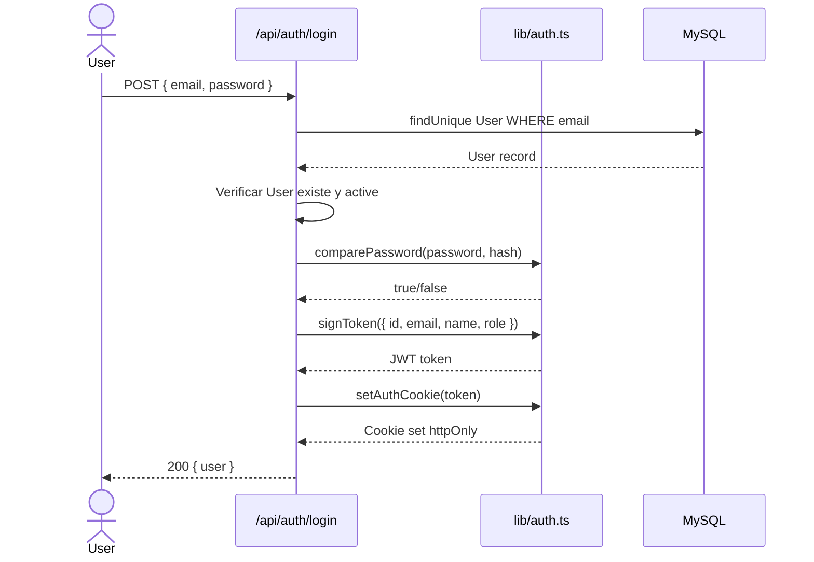
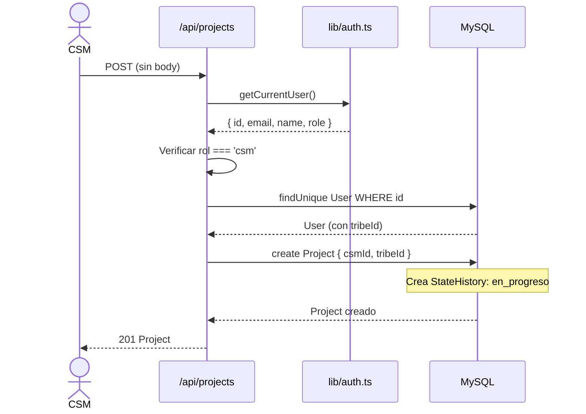
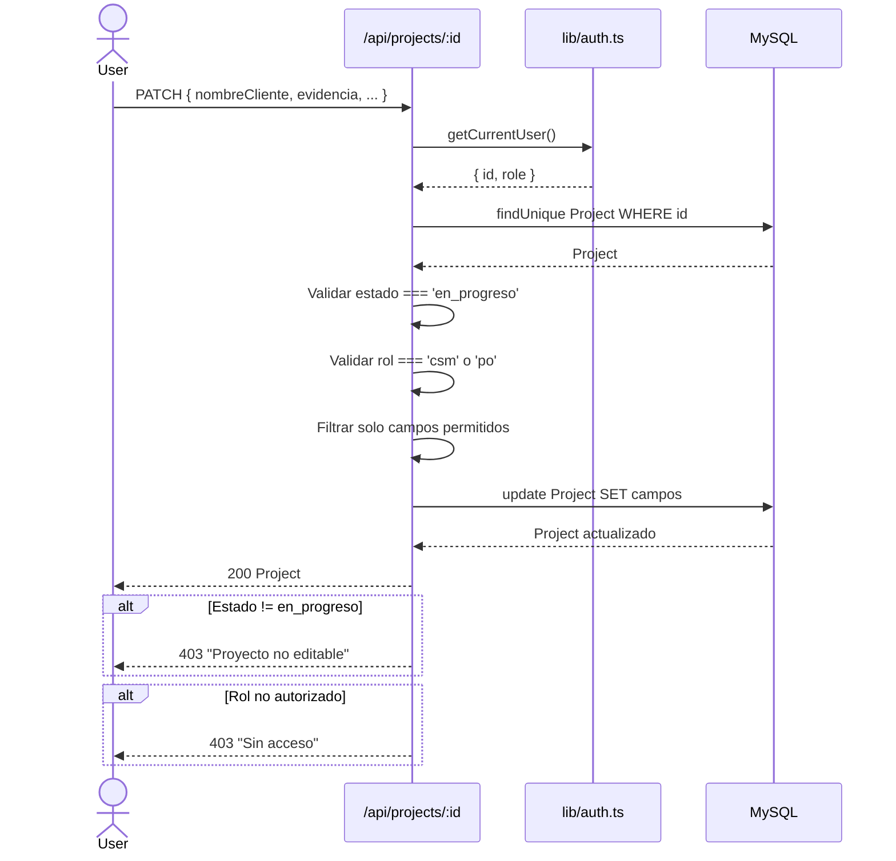
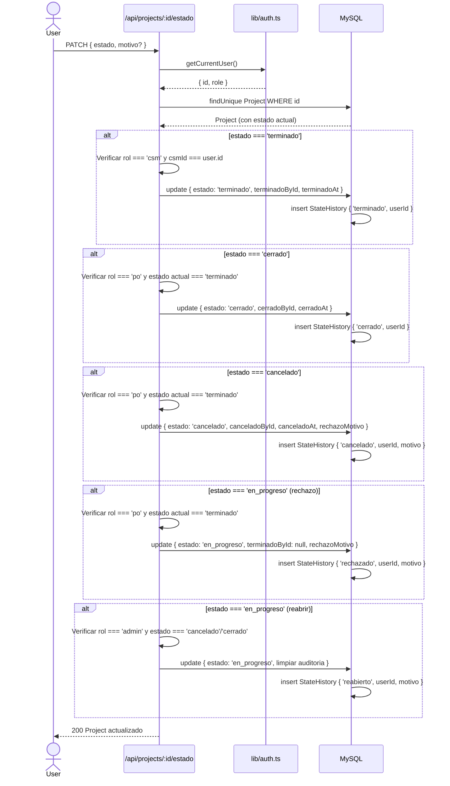
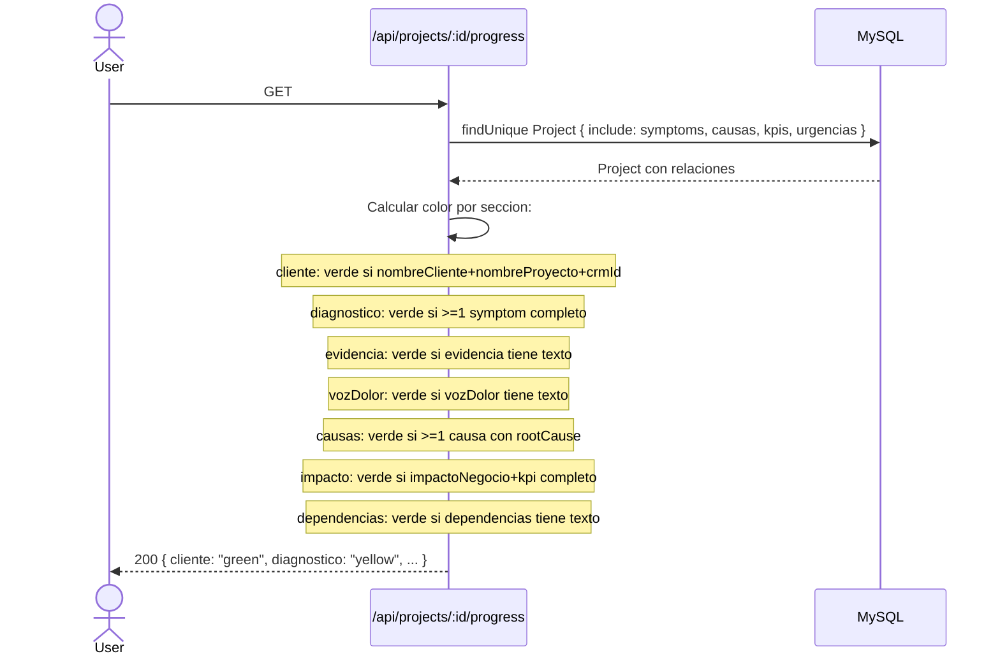
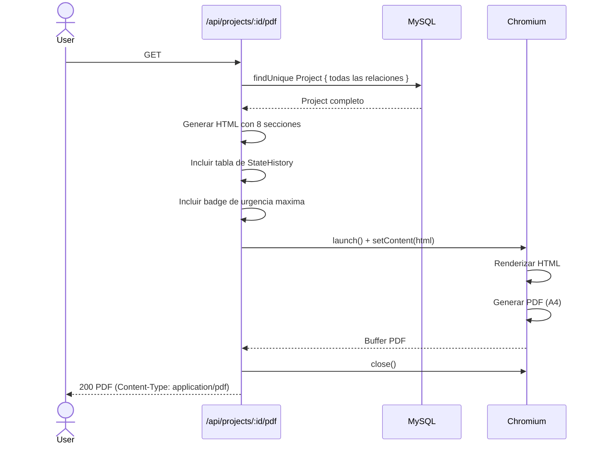
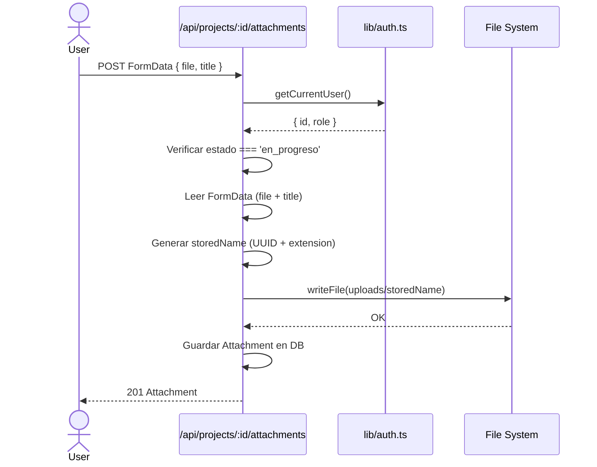
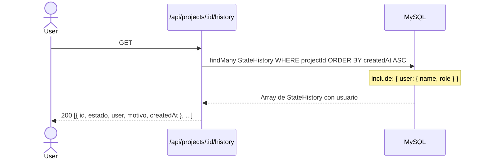

# Frisol v2 - API Endpoints

## Tabla Resumen

### Auth

| Metodo | Ruta | Descripcion | Auth | Rol |
|--------|------|-------------|------|-----|
| POST | /api/auth/login | Iniciar sesion | No | - |
| POST | /api/auth/logout | Cerrar sesion | Si | - |
| GET | /api/auth/me | Usuario actual (JWT) | Si | - |

### Projects

| Metodo | Ruta | Descripcion | Auth | Rol |
|--------|------|-------------|------|-----|
| GET | /api/projects | Listar proyectos | Si | todos |
| POST | /api/projects | Crear proyecto | Si | csm |
| GET | /api/projects/:id | Obtener proyecto | Si | todos |
| PATCH | /api/projects/:id | Actualizar campos | Si | csm (propio, en_progreso) |
| DELETE | /api/projects/:id | Soft delete | Si | csm (propio), po, admin |

### Sub-recursos del Proyecto

| Metodo | Ruta | Descripcion | Auth | Rol |
|--------|------|-------------|------|-----|
| GET | /api/projects/:id/symptoms | Listar sintomas | Si | todos |
| POST | /api/projects/:id/symptoms | Crear sintoma | Si | csm (en_progreso) |
| PATCH | /api/projects/:id/symptoms/:symptomId | Actualizar sintoma | Si | csm (en_progreso) |
| DELETE | /api/projects/:id/symptoms/:symptomId | Eliminar sintoma | Si | csm (en_progreso) |
| GET | /api/projects/:id/causas | Listar causas | Si | todos |
| POST | /api/projects/:id/causas | Crear causa | Si | csm (en_progreso) |
| PATCH | /api/projects/:id/causas/:causaId | Actualizar causa | Si | csm (en_progreso) |
| DELETE | /api/projects/:id/causas/:causaId | Eliminar causa | Si | csm (en_progreso) |
| GET | /api/projects/:id/kpis | Listar KPIs | Si | todos |
| POST | /api/projects/:id/kpis | Crear KPI | Si | csm (en_progreso) |
| PATCH | /api/projects/:id/kpis/:kpiId | Actualizar KPI | Si | csm (en_progreso) |
| DELETE | /api/projects/:id/kpis/:kpiId | Eliminar KPI | Si | csm (en_progreso) |
| GET | /api/projects/:id/urgencias | Listar urgencias | Si | todos |
| POST | /api/projects/:id/urgencias | Crear urgencia | Si | csm (en_progreso) |
| PATCH | /api/projects/:id/urgencias/:urgenciaId | Actualizar urgencia | Si | csm (en_progreso) |
| DELETE | /api/projects/:id/urgencias/:urgenciaId | Eliminar urgencia | Si | csm (en_progreso) |
| GET | /api/projects/:id/attachments | Listar adjuntos | Si | todos |
| POST | /api/projects/:id/attachments | Subir adjunto | Si | csm (en_progreso) |
| DELETE | /api/projects/:id/attachments/:attachmentId | Eliminar adjunto | Si | csm (en_progreso) |

### Estado y Utilidades

| Metodo | Ruta | Descripcion | Auth | Rol |
|--------|------|-------------|------|-----|
| PATCH | /api/projects/:id/estado | Cambiar estado | Si | csm/po/admin |
| GET | /api/projects/:id/progress | Progreso por seccion | Si | todos |
| GET | /api/projects/:id/history | Historial de estados | Si | todos |
| GET | /api/projects/:id/pdf | Exportar PDF | Si | todos |
| PUT | /api/projects/:id/update | Actualizar (legacy) | Si | csm |

### Admin

| Metodo | Ruta | Descripcion | Auth | Rol |
|--------|------|-------------|------|-----|
| GET | /api/users | Listar usuarios | Si | admin |
| POST | /api/users | Crear usuario | Si | admin |
| PATCH | /api/users/:id | Actualizar usuario | Si | admin |
| GET | /api/tribes | Listar tribus | Si | todos |

## Diagramas de Secuencia

### POST /api/auth/login



Body de ejemplo:
```json
{
  "email": "csm@frisol.com",
  "password": "password123"
}
```

### POST /api/projects (Crear Proyecto)



### PATCH /api/projects/:id (Actualizar Campos)



Campos permitidos: `nombreCliente`, `nombreProyecto`, `crmId`, `fechaInicio`, `interlocutores`, `tribeId`, `evidencia`, `vozDolor`, `impactoNegocio`, `dependencias`, `importancia`, `pedido`

### PATCH /api/projects/:id/estado (Cambiar Estado)



Body de ejemplo (rechazar):
```json
{
  "estado": "en_progreso",
  "motivo": "Faltan KPIs del modulo X. Los valores actuales no estan definidos."
}
```

### GET /api/projects/:id/progress (Progreso)



Respuesta de ejemplo:
```json
{
  "cliente": "green",
  "diagnostico": "yellow",
  "evidencia": "green",
  "vozDolor": "red",
  "causas": "green",
  "impacto": "yellow",
  "dependencias": "red"
}
```

### GET /api/projects/:id/pdf (Exportar PDF)



### POST /api/projects/:id/attachments (Subir Archivo)



### GET /api/projects/:id/history (Historial)


