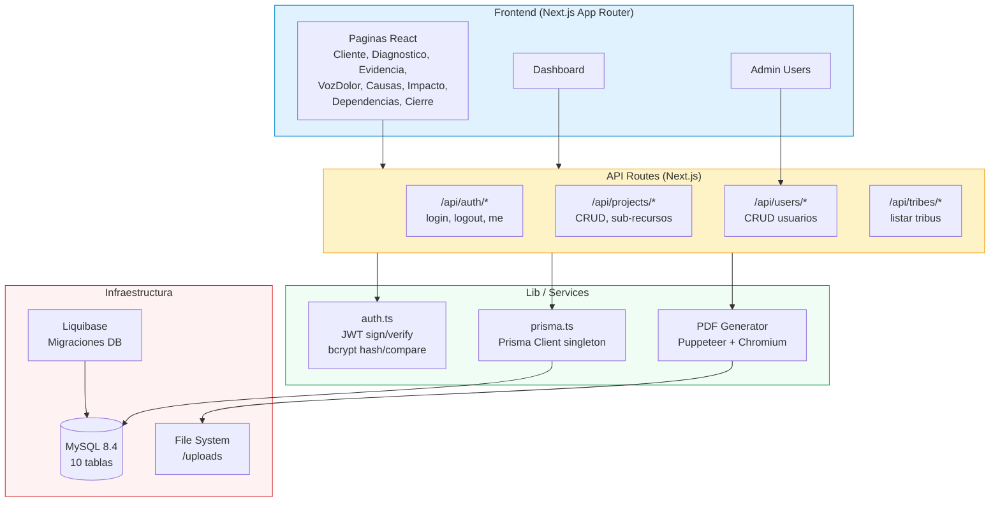
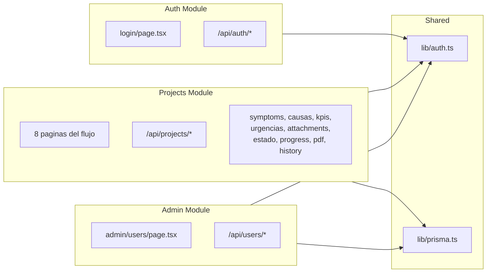
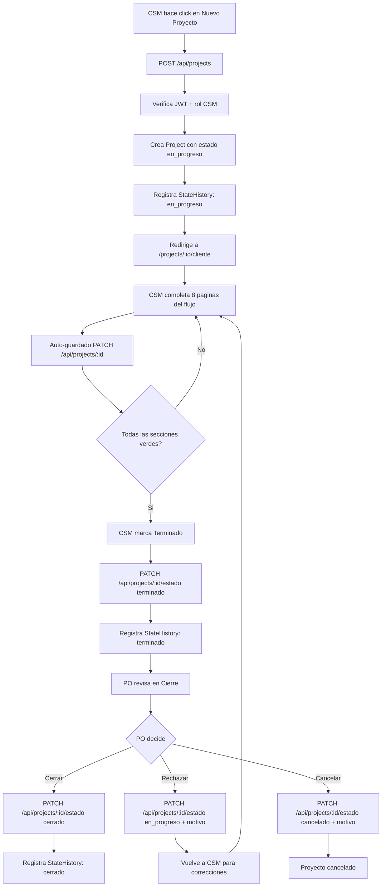
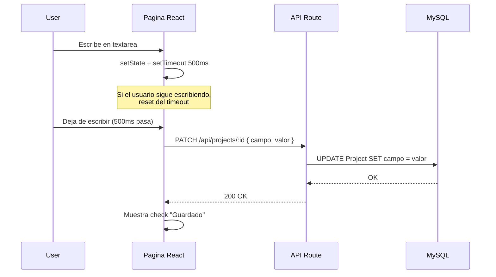
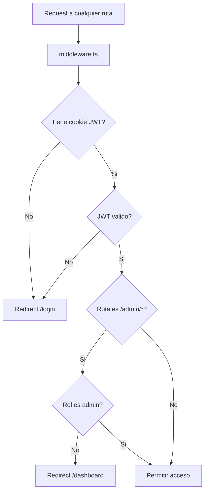

# Frisol v2 - Arquitectura

## Diagrama de Componentes

## Patron de Capas

| Capa | Ubicacion | Responsabilidad |
|------|-----------|-----------------|
| **Presentation** | `src/app/` | Paginas React, UI, navegacion client-side |
| **API Routes** | `src/app/api/` | Validacion de request, autenticacion, orquestacion |
| **Lib** | `src/lib/` | Logica compartida (auth, prisma client) |
| **Data Access** | Prisma Client | Queries tipadas, relaciones, transacciones |
| **Database** | MySQL 8.4 | Persistencia, indices, constraints FK |

El proyecto NO usa un patron Controller/Service/Repository tradicional. La logica de negocio vive directamente en los API Routes, que importan `prisma` y `auth` de `src/lib/`. Esto es tipico de Next.js App Router donde cada route handler es autocontenido.

## Modulos y Dependencias

| Modulo | Imports | Exports |
|--------|---------|---------|
| Auth | jsonwebtoken, bcryptjs, next/cookies | getCurrentUser, signToken, verifyToken, setAuthCookie |
| Projects | prisma, auth, puppeteer | 14 API routes + 8 paginas |
| Admin | prisma, auth | 2 API routes + 1 pagina |
| Shared (lib) | prisma, jsonwebtoken | auth.ts, prisma.ts |

## Flujo de Datos Principal (Crear Proyecto + Completar Flujo)

## Patron de Auto-guardado

Las 8 paginas del flujo usan un patron de auto-guardado con debounce de 500ms:

## Patron de Proteccion de Rutas

Middleware protege todas las rutas excepto `/login` y `/api/auth/*`. Rutas `/admin/*` requieren rol `admin`.