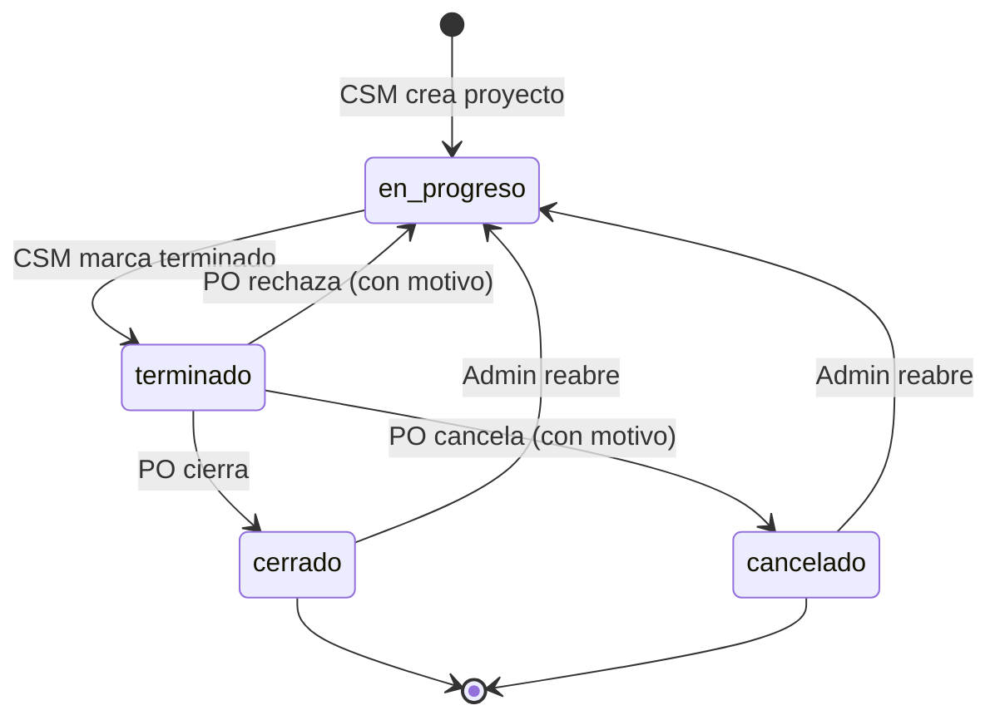
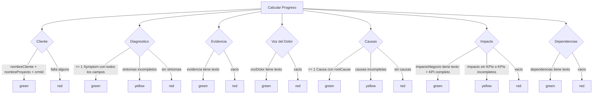
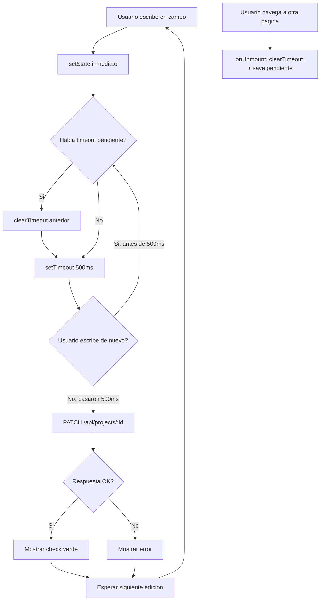

# Frisol v2 - Reglas de Negocio

## Reglas Generales

| # | Regla | Aplica a | Descripcion |
|---|-------|----------|-------------|
| R1 | Solo CSM puede crear proyectos | POST /api/projects | El rol del usuario debe ser "csm" |
| R2 | Solo el CSM dueño puede editar su proyecto | PATCH /api/projects/:id | csmId debe coincidir con user.id |
| R3 | Proyecto debe estar en_progreso para editar | PATCH, POST sub-recursos | Solo estado "en_progreso" permite escritura |
| R4 | Solo CSM puede marcar como terminado | PATCH /api/projects/:id/estado | csmId debe coincidir con user.id |
| R5 | Solo PO puede cerrar | PATCH /api/projects/:id/estado | Rol "po" y proyecto debe estar "terminado" |
| R6 | Solo PO puede cancelar | PATCH /api/projects/:id/estado | Rol "po" y proyecto debe estar "terminado" |
| R7 | Motivo requerido en rechazo | PATCH /api/projects/:id/estado | El campo "motivo" es obligatorio al rechazar |
| R8 | Motivo requerido en cancelacion | PATCH /api/projects/:id/estado | El campo "motivo" es obligatorio al cancelar |
| R9 | Solo Admin puede reabrir | PATCH /api/projects/:id/estado | Solo rol "admin" puede reabrir cancelados/cerrados |
| R10 | Soft delete | DELETE /api/projects/:id | No se borra fisicamente, se setea deleted_at |
| R11 | Cada cambio de estado se audita | PATCH /api/projects/:id/estado | Se inserta registro en StateHistory |
| R12 | JWT cookie httpOnly | Auth | Token en cookie httpOnly, no accesible por JS |

## Flujo de Estados del Proyecto



### Transiciones Permitidas

| Estado Actual | Nuevo Estado | Quien puede | Motivo requerido |
|---------------|-------------|-------------|-----------------|
| en_progreso | terminado | CSM (dueño) | No |
| terminado | cerrado | PO | No |
| terminado | cancelado | PO | Si |
| terminado | en_progreso | PO (rechazo) | Si |
| cancelado | en_progreso | Admin (reabrir) | Opcional |
| cerrado | en_progreso | Admin (reabrir) | Opcional |

### Transiciones NO Permitidas

| Estado Actual | Nuevo Estado | Motivo |
|---------------|-------------|--------|
| en_progreso | cerrado | Debe pasar por terminado primero |
| en_progreso | cancelado | Solo se cancela desde terminado |
| cerrado | terminado | Ya fue cerrado, usar reabrir |
| cancelado | terminado | Ya fue cancelado, usar reabrir |
| cancelado | cerrado | Ya fue cancelado, usar reabrir |
| cerrado | cancelado | Ya fue cerrado, usar reabrir |

## Reglas de Progreso

El progreso se calcula por seccion y tiene 3 estados: `red` (vacio), `yellow` (parcial), `green` (completo).



**Regla para Terminar:** Todas las secciones deben estar en `green` para que el CSM pueda marcar como terminado.

## Reglas de Roles y Permisos

```mermaid
flowchart LR
    subgraph Admin["Admin"]
        A1[Gestionar usuarios]
        A2[Ver todos los proyectos]
        A3[Reabrir proyectos]
    end

    subgraph CSM["CSM"]
        C1[Crear proyectos]
        C2[Editar sus proyectos en_progreso]
        C3[Marcar como terminado]
    end

    subgraph PO["PO"]
        P1[Ver proyectos terminados]
        P2[Cerrar proyectos]
        P3[Rechazar proyectos]
        P4[Cancelar proyectos]
    end

    subgraph Dev["Dev"]
        D1[Ver proyectos (futuro)]
    end
```

| Accion | Admin | CSM | PO | Dev |
|--------|-------|-----|-----|-----|
| Crear proyecto | - | Si (propio) | - | - |
| Editar proyecto en_progreso | - | Si (propio) | - | - |
| Marcar terminado | - | Si (propio) | - | - |
| Cerrar proyecto | - | - | Si | - |
| Rechazar proyecto | - | - | Si | - |
| Cancelar proyecto | - | - | Si | - |
| Reabrir proyecto | Si | - | - | - |
| Eliminar proyecto | Si | Si (propio) | Si | - |
| Gestionar usuarios | Si | - | - | - |
| Ver todos los proyectos | Si | Si (filtro) | Si | Si |
| Exportar PDF | Si | Si | Si | Si |

## Reglas de Auto-guardado



- **Debounce:** 500ms despues de la ultima tecla
- **Save on unmount:** Si hay un guardado pendiente al salir de la pagina, se ejecuta inmediatamente
- **Feedback visual:** "Guardando..." (amarillo) -> "Guardado" (verde) -> desaparece

## Reglas de Urgencias

| # | Regla | Descripcion |
|---|-------|-------------|
| U1 | Seccion opcional | Las urgencias son opcionales, no bloquean el progreso |
| U2 | Muestra maxima | Donde se muestra badge, se muestra la urgencia mas alta (alta > media > baja) |
| U3 | Campos por urgencia | Cada urgencia tiene: tipo (select), justificacion (textarea), fecha deseada (date) |
| U4 | CRUD completo | Se pueden agregar, editar y eliminar urgencias individualmente |

## Tabla de Errores HTTP

| Codigo | Escenario | Mensaje |
|--------|-----------|---------|
| 400 | Estado invalido en cambio de estado | "Estado invalido" |
| 401 | Sin cookie JWT | "No autenticado" |
| 401 | JWT expirado o invalido | "No autenticado" |
| 403 | CSM intenta editar proyecto ajeno | "No es tu proyecto" |
| 403 | CSM intenta terminar proyecto ajeno | "No es tu proyecto" |
| 403 | CSM intenta terminar sin todos verdes | "No se puede terminar. Secciones incompletas" |
| 403 | PO intenta cerrar proyecto no terminado | "Debe estar terminado primero" |
| 403 | PO intenta cancelar proyecto no terminado | "Solo se puede cancelar desde terminado" |
| 403 | Rol no autorizado para accion | "Sin permisos" / "Sin acceso" |
| 403 | Rol no CSM intenta crear proyecto | "Solo CSM puede crear proyectos" |
| 403 | Rol no PO intenta cerrar/cancelar | "Solo PO puede cerrar" / "Solo PO puede cancelar" |
| 403 | Proyecto no esta en_progreso | "No editable" |
| 404 | Proyecto no encontrado | "No encontrado" / "Proyecto no encontrado" |
| 404 | Sub-recurso no encontrado | "No encontrado" |
| 500 | Error interno del servidor | Error no manejado |
| P2003 | FK constraint violada | Prisma: Foreign key constraint violated |
| P2025 | Registro no encontrado para update/delete | Prisma: Record not found |

## Reglas de PDF

| # | Regla | Descripcion |
|---|-------|-------------|
| PDF1 | Formato A4 | El PDF se genera en formato A4 |
| PDF2 | Watermark en borrador | Proyectos en_progreso muestran marca "BORRADOR" |
| PDF3 | 8 secciones | El PDF contiene las mismas 8 secciones del flujo |
| PDF4 | Historial completo | Incluye tabla de StateHistory con todos los cambios |
| PDF5 | Badge de urgencia | Muestra la urgencia mas alta junto al ID si existe |
| PDF6 | Datos de cierre | Muestra quien termino, cerro, o cancelo con fecha |

## Reglas de Archivos Adjuntos

| # | Regla | Descripcion |
|---|-------|-------------|
| A1 | Solo en_progreso | Solo se pueden subir/eliminar adjuntos si el proyecto esta en_progreso |
| A2 | Almacenamiento local | Los archivos se guardan en /uploads con nombre UUID |
| A3 | Sin limite de tipo | Se acepta cualquier tipo de archivo |
| A4 | Metadatos en DB | Nombre original, tamano y titulo se guardan en la tabla Attachment |
