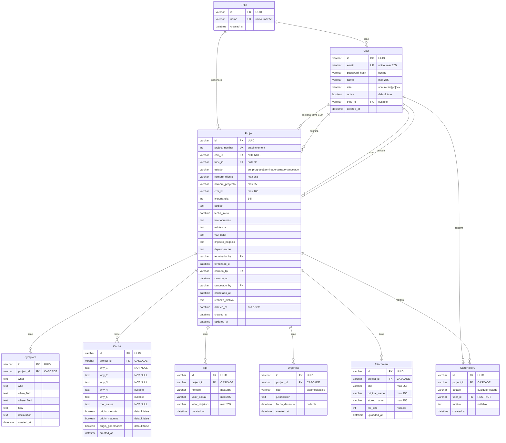

# Frisol v2 - Modelo de Datos

## Diagrama E-R

## Descripcion de Tablas

### Tribe

| Campo | Tipo | Nullable | Descripcion |
|-------|------|----------|-------------|
| id | VARCHAR(191) | No | UUID, PK |
| name | VARCHAR(50) | No | Nombre de la tribu, UNIQUE |
| created_at | DATETIME(3) | No | Fecha de creacion, auto |

### User

| Campo | Tipo | Nullable | Descripcion |
|-------|------|----------|-------------|
| id | VARCHAR(191) | No | UUID, PK |
| email | VARCHAR(255) | No | Email unico para login, UNIQUE |
| password_hash | VARCHAR(191) | No | Hash bcrypt de la contrasena |
| name | VARCHAR(255) | No | Nombre completo del usuario |
| role | VARCHAR(20) | No | Rol: admin, csm, po, dev |
| active | BOOLEAN | No | Si el usuario esta activo, default true |
| tribe_id | VARCHAR(191) | Si | FK a Tribe, nullable |
| created_at | DATETIME(3) | No | Fecha de creacion, auto |

### Project

| Campo | Tipo | Nullable | Descripcion |
|-------|------|----------|-------------|
| id | VARCHAR(191) | No | UUID, PK |
| project_number | INT | No | Numero humano legible (PRJ-00001), autoincrement, UNIQUE |
| csm_id | VARCHAR(191) | No | FK a User, CSM responsable |
| tribe_id | VARCHAR(191) | Si | FK a Tribe, tribu del proyecto |
| estado | VARCHAR(20) | No | Estado actual, default "en_progreso" |
| nombre_cliente | VARCHAR(255) | Si | Nombre del cliente |
| nombre_proyecto | VARCHAR(255) | Si | Nombre del proyecto |
| crm_id | VARCHAR(100) | Si | ID del CRM del cliente |
| importancia | INT | Si | Importancia 1-5 |
| pedido | TEXT | Si | Descripcion del pedido del cliente |
| fecha_inicio | DATETIME(3) | Si | Fecha de inicio del proyecto |
| interlocutores | TEXT | Si | Lista de interlocutores clave |
| evidencia | TEXT | Si | Evidencia del problema |
| voz_dolor | TEXT | Si | Voz del dolor del cliente |
| impacto_negocio | TEXT | Si | Impacto de negocio / business case |
| dependencias | TEXT | Si | Dependencias del proyecto |
| terminado_by | VARCHAR(191) | Si | FK a User, quien lo marco terminado |
| terminado_at | DATETIME(3) | Si | Cuando se marco terminado |
| cerrado_by | VARCHAR(191) | Si | FK a User, quien lo cerro |
| cerrado_at | DATETIME(3) | Si | Cuando se cerro |
| cancelado_by | VARCHAR(191) | Si | FK a User, quien lo cancelo |
| cancelado_at | DATETIME(3) | Si | Cuando se cancelo |
| rechazo_motivo | TEXT | Si | Motivo de rechazo o cancelacion |
| deleted_at | DATETIME(3) | Si | Soft delete, null = activo |
| created_at | DATETIME(3) | No | Fecha de creacion, auto |
| updated_at | DATETIME(3) | No | Fecha de ultima actualizacion, auto |

### Symptom (Sintomas del Diagnostico 5WTH)

| Campo | Tipo | Nullable | Descripcion |
|-------|------|----------|-------------|
| id | VARCHAR(191) | No | UUID, PK |
| project_id | VARCHAR(191) | No | FK a Project (CASCADE) |
| what | TEXT | No | Que esta pasando |
| who | TEXT | No | A quien afecta |
| when_field | TEXT | No | Cuando ocurre |
| where_field | TEXT | Donde ocurre |
| how | TEXT | No | Como se manifiesta |
| declaration | TEXT | No | Declaracion sintetizada |
| created_at | DATETIME(3) | No | Fecha de creacion, auto |

### Causa (Analisis de Causas - 5 Whys)

| Campo | Tipo | Nullable | Descripcion |
|-------|------|----------|-------------|
| id | VARCHAR(191) | No | UUID, PK |
| project_id | VARCHAR(191) | No | FK a Project (CASCADE) |
| why_1 | TEXT | No | Primer por que |
| why_2 | TEXT | No | Segundo por que |
| why_3 | TEXT | No | Tercer por que |
| why_4 | TEXT | Si | Cuarto por que (opcional) |
| why_5 | TEXT | Si | Quinto por que (opcional) |
| root_cause | TEXT | No | Causa raiz identificada |
| origin_metodo | BOOLEAN | No | Origen: Metodo, default false |
| origin_maquina | BOOLEAN | No | Origen: Maquina, default false |
| origin_gobernanza | BOOLEAN | No | Origen: Gobernanza, default false |
| created_at | DATETIME(3) | No | Fecha de creacion, auto |

### Kpi (Indicadores de Impacto)

| Campo | Tipo | Nullable | Descripcion |
|-------|------|----------|-------------|
| id | VARCHAR(191) | No | UUID, PK |
| project_id | VARCHAR(191) | No | FK a Project (CASCADE) |
| nombre | VARCHAR(255) | No | Nombre del KPI |
| valor_actual | VARCHAR(255) | No | Valor actual del KPI |
| valor_objetivo | VARCHAR(255) | No | Valor objetivo del KPI |
| created_at | DATETIME(3) | No | Fecha de creacion, auto |

### Urgencia (Dependencias del Proyecto)

| Campo | Tipo | Nullable | Descripcion |
|-------|------|----------|-------------|
| id | VARCHAR(191) | No | UUID, PK |
| project_id | VARCHAR(191) | No | FK a Project (CASCADE) |
| tipo | VARCHAR(20) | No | Nivel: alta, media, baja |
| justificacion | TEXT | No | Justificacion de la urgencia |
| fecha_deseada | DATETIME(3) | Si | Fecha deseada de resolucion |
| created_at | DATETIME(3) | No | Fecha de creacion, auto |

### Attachment (Archivos Adjuntos)

| Campo | Tipo | Nullable | Descripcion |
|-------|------|----------|-------------|
| id | VARCHAR(191) | No | UUID, PK |
| project_id | VARCHAR(191) | No | FK a Project (CASCADE) |
| title | VARCHAR(255) | No | Titulo descriptivo |
| original_name | VARCHAR(255) | No | Nombre original del archivo |
| stored_name | VARCHAR(255) | No | Nombre en disco (UUID + extension) |
| file_size | INT | Si | Tamano en bytes |
| uploaded_at | DATETIME(3) | No | Fecha de subida, auto |

### StateHistory (Auditoria de Estados)

| Campo | Tipo | Nullable | Descripcion |
|-------|------|----------|-------------|
| id | VARCHAR(191) | No | UUID, PK |
| project_id | VARCHAR(191) | No | FK a Project (CASCADE) |
| estado | VARCHAR(20) | No | Estado al que se transiciono |
| user_id | VARCHAR(191) | No | FK a User (RESTRICT), quien hizo el cambio |
| motivo | TEXT | Si | Motivo del cambio (requerido en rechazo/cancelacion) |
| created_at | DATETIME(3) | No | Fecha del cambio, auto |

**Indice:** `(project_id, created_at)` para consultas por proyecto ordenadas cronologicamente.

## Enums

### User.role

| Valor | Descripcion |
|-------|-------------|
| admin | Acceso total, gestion de usuarios, reabrir proyectos |
| csm | Crea y completa proyectos, marca como terminado |
| po | Revisa proyectos terminados, cierra o rechaza |
| dev | Solo lectura (futuro) |

### Project.estado

| Valor | Descripcion |
|-------|-------------|
| en_progreso | Estado inicial, CSM completa las 8 secciones |
| terminado | CSM termino, PO puede revisar |
| cerrado | PO cerro, proyecto entregado a desarrollo |
| cancelado | PO cancelo con motivo |

### Urgencia.tipo

| Valor | Descripcion |
|-------|-------------|
| alta | Urgencia alta, requiere atencion inmediata |
| media | Urgencia media, prioridad normal |
| baja | Urgencia baja, puede esperar |

## Constraints

| Tabla | Constraint | Campos | Descripcion |
|-------|-----------|--------|-------------|
| User | UNIQUE | email | Un email por usuario |
| Tribe | UNIQUE | name | Un nombre por tribu |
| Project | UNIQUE | project_number | Numero autoincrement unico |
| Project | FK | csm_id -> User | CSM debe existir, RESTRICT |
| Project | FK | tribe_id -> Tribe | Tribu nullable, SET NULL |
| Project | FK | terminado_by -> User | SET NULL en delete |
| Project | FK | cerrado_by -> User | SET NULL en delete |
| Project | FK | cancelado_by -> User | SET NULL en delete |
| Symptom | FK | project_id -> Project | CASCADE en delete |
| Causa | FK | project_id -> Project | CASCADE en delete |
| Kpi | FK | project_id -> Project | CASCADE en delete |
| Urgencia | FK | project_id -> Project | CASCADE en delete |
| Attachment | FK | project_id -> Project | CASCADE en delete |
| StateHistory | FK | project_id -> Project | CASCADE en delete |
| StateHistory | FK | user_id -> User | RESTRICT (no borrar usuario con historial) |
| StateHistory | INDEX | (project_id, created_at) | Consultas por proyecto |
